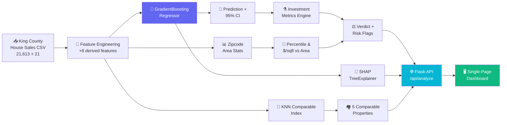

<div align="center">

# 🏠 EstateIQ

### Real Estate Investment Analyzer

**A full-stack ML web app that prices a house, explains *why*, finds comparable sales, and grades the deal as an investment — all from a single Google Colab notebook.**

[](https://www.python.org/)
[](https://scikit-learn.org/)
[](https://shap.readthedocs.io/)
[](https://flask.palletsprojects.com/)
[](https://colab.research.google.com/)
[](LICENSE)

[Overview](#-overview) · [Features](#-features) · [Results](#-model-performance) · [Setup](#-setup) · [API](#-api-reference) · [Roadmap](#-roadmap)

</div>

---

## 📖 Overview

Most price predictors hand you a number and walk away. EstateIQ hands you a number, a confidence interval, the eight features that moved that number up or down, five real comparable sales, a rent estimate, a cap rate, a verdict, and a list of things that could go wrong.

It's built as a **single self-contained Colab notebook** that:

1. Downloads the **King County House Sales** dataset (21,613 sales, 21 columns).
2. Engineers 8 derived features on top of the raw schema.
3. Trains a `GradientBoostingRegressor` to predict sale price.
4. Wraps the model in a **Flask API** with a **SHAP** explainer and a **KNN** comparable-sales index.
5. Serves a glassmorphic single-page dashboard through an **ngrok** tunnel — so you get a live public URL from Colab with zero deployment setup.

No cloud account. No Docker. No model serving infrastructure. Just **Run All**.

---

## ✨ Features

| | Feature | What it does |
|---|---|---|
| 💰 | **Price Prediction** | Gradient Boosting regression with a 95% confidence interval derived from training residual σ |
| 🧠 | **SHAP Explanations** | Per-prediction feature attributions — see exactly which attributes added or subtracted dollars |
| 🏘️ | **Comparable Sales (KNN)** | Standardized nearest-neighbour search over 8 property features returns 5 real sold homes |
| 📊 | **Zipcode Analytics** | Median price, median $/sqft, listing count, and your property's percentile within its zipcode |
| 📈 | **Investment Metrics** | Estimated monthly rent, gross yield, cap rate, annual tax, and a 5-year value projection |
| 🎯 | **Deal Verdict** | `UNDERVALUED` / `FAIR PRICE` / `OVERVALUED` based on the comparable-sales median |
| ⚠️ | **Risk Flags** | Automatic warnings for overpriced $/sqft, old unrenovated homes, low condition/grade, tiny layouts, and odd bedroom counts |
| 🖥️ | **Live Dashboard** | Zero-build single-page frontend with a Chart.js SHAP waterfall bar chart |
| 🌐 | **Public URL in Colab** | Flask + pyngrok — one cell gives you a shareable `https://…ngrok-free.dev` link |

---

## 🧱 Architecture



---

## 📊 Model Performance

Evaluated on a held-out 20% test split (**4,323 properties**):

| Metric | Value |
|---|---|
| **Test R²** | **0.8741** |
| Train R² | 0.9611 |
| **MAE** | **$69,489** |
| **MAPE** | **12.76%** |
| Median Absolute Error | $40,129 |
| Predictions within ±10% of actual | 54.4% |
| Predictions within ±20% of actual | 82.0% |
| Residual σ (used for CI) | $71,330 |

> **Interpretation:** the model explains ~87% of price variance on unseen data, and **82% of predictions land within ±20% of the true sale price** — reasonable for real-estate valuation, where location alone can dominate.

### Sample Prediction

Input: `4 bed · 2.5 bath · 2,500 sqft · Bellevue, WA 98004 · built 1995 · renovated 2015 · grade 8 · view 2`

```
Estimated Price : $1,224,388
95% Range       : $1,084,582 — $1,364,194
Price / Sqft    : $490
Verdict         : OVERVALUED

Monthly Rent    : $4,898
Gross Yield     : 4.80%
Cap Rate        : 3.88%

Top SHAP drivers:
  lat         +$274,780
  zipcode     +$163,083
  view         +$76,579
  long         +$57,682
  sqft_above   +$43,592
```

Notice what the model is telling you: **latitude, zipcode, and longitude outweigh the house itself.** Location is not a feature here — it's *the* feature.

---

## 📁 Dataset

**King County House Sales** (Washington State, USA) — 21,613 transactions, 21 columns.

| Column group | Fields |
|---|---|
| Identity | `id`, `date` |
| **Target** | `price` |
| Structure | `bedrooms`, `bathrooms`, `sqft_living`, `sqft_lot`, `floors`, `sqft_above`, `sqft_basement` |
| Quality | `grade` (1–13), `condition` (1–5), `view` (0–4), `waterfront` (0/1) |
| Age | `yr_built`, `yr_renovated` |
| Location | `zipcode`, `lat`, `long` |
| Neighbourhood | `sqft_living15`, `sqft_lot15` |

Loaded directly from a raw GitHub URL — no manual download step.

---

## 🔧 Feature Engineering

Eight features are derived before training, all of which feed the model:

| Feature | Formula | Why |
|---|---|---|
| `house_age` | `2025 − yr_built` | Age is more informative than a raw year |
| `is_renovated` | `yr_renovated > 0` | Binary renovation signal |
| `yrs_since_renov` | `2025 − yr_renovated` (else `house_age`) | Renovation recency |
| `total_rooms` | `bedrooms + bathrooms` | Overall capacity |
| `sqft_ratio` | `sqft_living / sqft_lot` | Building density on the lot |
| `basement_ratio` | `sqft_basement / sqft_living` | Share of usable below-grade space |
| `living15_ratio` | `sqft_living / sqft_living15` | How you compare to neighbours |
| `lot15_ratio` | `sqft_lot / sqft_lot15` | Lot size relative to the block |

Plus `price_per_sqft`, computed for the zipcode analytics layer.

**Final feature count: 26.**

---

## 🚀 Setup

### Prerequisites

- A Google account (for Colab)
- A free ngrok account — [get your token here](https://dashboard.ngrok.com/get-started/your-authtoken)

### Steps

**1. Open the notebook**

Upload `EstateIQ_v1.ipynb` to [Google Colab](https://colab.research.google.com/) or open it directly from this repo.

**2. Add your ngrok token as a Colab Secret**

- Click the 🔑 **key icon** in the left sidebar
- Click **"Add new secret"**
- **Name:** `NGROK_TOKEN`
- **Value:** your ngrok authtoken
- Toggle **"Notebook access"** → **ON**

> ⚠️ If you skip this, Cell 8 will raise a `SystemExit` with instructions rather than failing silently.

**3. Run all cells top to bottom**

```
Runtime → Run all
```

Cells 1–7 set up dependencies, data, model, explainer, and the frontend. Cell 8 launches everything.

**4. Open the live URL**

Cell 8 prints:

```
================================================================
🌐  LIVE URL:  https://<your-tunnel>.ngrok-free.dev
================================================================
```

Open it in any browser — the dashboard is live.

**5. (Optional) Verify the API**

Run Cell 9. It POSTs a sample Bellevue property to your live endpoint and prints the full response.

**6. (Optional) Review model metrics**

Run Cell 10 for the complete evaluation report.

**To shut down the tunnel:**

```python
from pyngrok import ngrok
ngrok.kill()
```

---

## 📓 Notebook Walkthrough

| Cell | Purpose |
|:---:|---|
| **1** | Install `flask`, `pyngrok`, `shap`, `scikit-learn`, `pandas`, `numpy` |
| **2** | Download the King County dataset, print schema |
| **3** | Feature engineering, 80/20 split, train `GradientBoostingRegressor`, compute residual σ |
| **4** | Zipcode area statistics + build the KNN comparable-properties index |
| **5** | Build the SHAP `TreeExplainer` (~20 s) |
| **6** | Define the Flask app, `build_feature_row()`, `analyze()`, and the `/api/analyze` route |
| **7** | Define the full single-page dashboard as the `HTML_PAGE` string |
| **8** | **Launch** — read secret, free port 5000, start Flask in a daemon thread, open ngrok tunnel |
| **9** | Integration test against the live URL |
| **10** | Full evaluation metrics (R², MAE, MAPE, error bands) |

---

## 🔌 API Reference

### `POST /api/analyze`

Accepts a JSON body of property attributes. All fields are optional — sensible defaults are applied.

**Request**

```json
{
  "bedrooms": 4,
  "bathrooms": 2.5,
  "sqft_living": 2500,
  "sqft_lot": 6000,
  "floors": 2,
  "waterfront": 0,
  "view": 2,
  "condition": 4,
  "grade": 8,
  "sqft_above": 2500,
  "sqft_basement": 0,
  "yr_built": 1995,
  "yr_renovated": 2015,
  "zipcode": 98004,
  "lat": 47.6279,
  "long": -122.2030,
  "sqft_living15": 2400,
  "sqft_lot15": 5800
}
```

**Response**

```json
{
  "price": 1224388,
  "range_low": 1084582,
  "range_high": 1364194,
  "price_per_sqft": 490,
  "area": {
    "zipcode": 98004,
    "median_price": 1085000,
    "median_ppsf": 442,
    "count": 120,
    "percentile": 78.3,
    "ppsf_vs_area": 10.9
  },
  "comparables": [ /* 5 comparable sold properties */ ],
  "comparable_median": 1120000,
  "investment": {
    "monthly_rent": 4898,
    "annual_rent": 58770,
    "gross_yield": 4.8,
    "annual_tax": 11264,
    "cap_rate": 3.88,
    "five_yr_value": 1489723
  },
  "verdict": "OVERVALUED",
  "verdict_color": "red",
  "risk_flags": ["No major risk flags detected"],
  "shap": [
    { "feature": "lat", "value": 47.6279, "impact": 274780 },
    { "feature": "zipcode", "value": 98004, "impact": 163083 }
  ]
}
```

---

## 🧮 Methodology Notes

### Investment Heuristics

These are **transparent, tunable estimates** — not market data feeds:

| Metric | Formula | Assumption |
|---|---|---|
| Monthly rent | `price × 0.004` | ~4.8% gross annual yield |
| Annual tax | `price × 0.0092` | King County effective rate ≈ 0.92% |
| Gross yield | `(annual_rent / price) × 100` | Before expenses |
| Cap rate | `((annual_rent − annual_tax) / price) × 100` | Tax-only expense model |
| 5-year value | `price × 1.04⁵` | 4% annual appreciation |

### Verdict Logic

| Condition | Verdict |
|---|---|
| `price < comparable_median × 0.92` | 🟢 `UNDERVALUED` |
| `price > comparable_median × 1.08` | 🔴 `OVERVALUED` |
| otherwise | 🟡 `FAIR PRICE` |

### Risk Flag Thresholds

- $/sqft more than **25% above** the zipcode median
- House older than **50 years** with **no renovation**
- Condition score **≤ 2**
- Grade **≤ 5**
- Living area **< 1,000 sqft**
- Bedrooms **≥ 6** (layout verification recommended)

### Confidence Interval

`price ± 1.96 × σ_residual` where `σ_residual = $71,330` is the standard deviation of training residuals. This is a **global** interval — it does not widen for unusual inputs. Per-prediction uncertainty would require quantile regression or conformal prediction.

---

## ⚠️ Limitations

- **Global confidence interval.** All predictions share the same ±$139,806 band regardless of how unusual the input is.
- **Heuristic rental model.** Rent is derived from price, not from actual rental listings — gross yield is therefore nearly constant (~4.8%) across all properties. Treat yield comparisons as non-informative.
- **Dataset vintage.** Trained on historical King County sales; predictions are in that market's dollar terms, not inflation-adjusted to today.
- **Model drift.** Zipcode-level price levels change; retrain for current-market accuracy.
- **Not a substitute for an appraisal.** This is a decision-support tool, not a licensed valuation.
- **ngrok free tier.** Tunnel URLs rotate on restart and may show an interstitial warning page.

---

## 🗺️ Roadmap

- [ ] **Per-prediction uncertainty** via quantile regression / conformal prediction
- [ ] **Real rental data integration** (RentCast, HUD, or Zillow ZORI) to replace the yield heuristic
- [ ] **Time-aware features** — sale month/season, rolling zipcode price index
- [ ] **Geospatial map view** — plot comparables on an interactive map
- [ ] **Model comparison harness** — XGBoost, LightGBM, CatBoost, and tuned GBR side by side
- [ ] **SHAP waterfall charts** in the UI instead of a simple bar chart
- [ ] **Dockerize** for persistent deployment beyond Colab
- [ ] **Batch CSV mode** — score a whole portfolio in one upload
- [ ] **Unit tests** for `build_feature_row()` and the investment engine

---

## 📂 Project Structure

```
EstateIQ/
├── EstateIQ_v1.ipynb    # The entire application — data, model, API, frontend
├── LICENSE              # MIT
└── README.md
```

The notebook is intentionally monolithic: it is designed to be **opened and run end-to-end in Colab** without cloning, building, or configuring anything.

---

## 🤝 Contributing

Contributions are welcome. Fork the repo, create a feature branch, and open a pull request.

```bash
git checkout -b feature/rental-data-integration
git commit -m "feat: integrate real rental listings for yield calculation"
git push origin feature/rental-data-integration
```

Ideas that would help most: real rental data, per-prediction uncertainty, and model comparison benchmarks.

---

## 📄 License

Released under the **MIT License** — see [LICENSE](LICENSE) for details.

```
Copyright (c) 2026 KUSHAL KUMAR J
```

---

<div align="center">

**Built by [Kushal Kumar J](https://github.com/kushalkumarj2006)**

*EstateIQ — because a price without an explanation is just a guess.*

⭐ If this project helped you, consider giving it a star.

</div>
